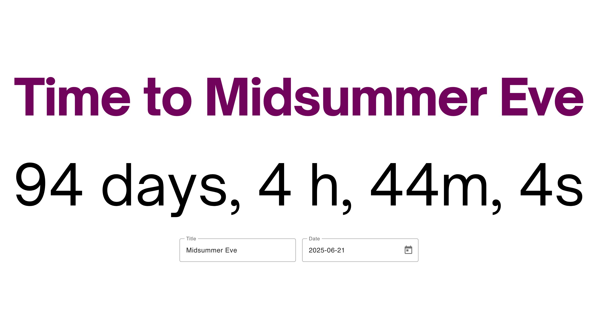

# FrontendChallenge

This is a code test.

## Setup

Install by running `npm ci`

## Running the app

Run `npm start` for a dev server. Navigate to `http://localhost:4200/`. The application will automatically reload if you change any of the source files. 

## Potential improvments

- Add working unit tests
- Add end-to-end tests
- Add an animation when first showing title and count down.
- Add dynamic counting, i.e. see the numbers count down without interacting with the page.
